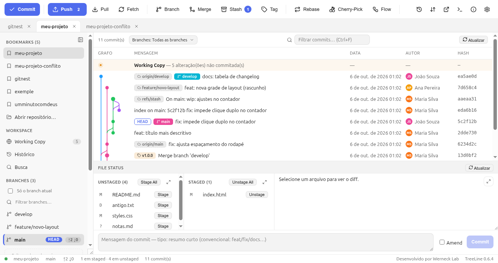
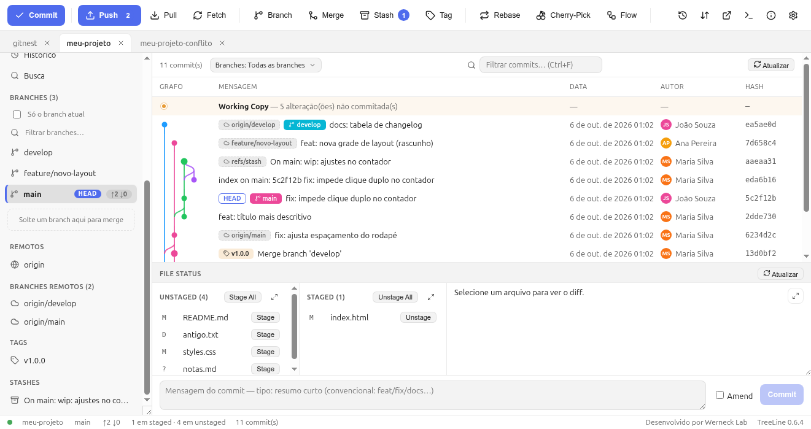

# 3. Tour pela janela

A tela tem **5 regiões**. Tudo que é operação de Git está a um clique —
não existe menu escondido.

## 3.1 Toolbar (topo)

Ordem igualzinha à do SourceTree:

| Grupo | Botões |
|---|---|
| Sincronizar | **Commit** · **Push** · **Pull** · **Fetch** |
| Linhas do tempo | **Branch** · **Merge** · **Stash** · **Tag** · **Rebase** · **Cherry-Pick** · **Git-flow** |
| Utilitários (só ícone) | Histórico/Reflog · Status de sync (remotos) · Abrir PR · Terminal · Sobre · Settings |

Detalhes que importam:

- **Commit** só fica ativo quando existe algo staged **e** mensagem digitada
  (evita o famoso “Nothing staged”). Atalho `Ctrl+Enter`.
- **Push** fica primário (destacado) quando você tem commits a enviar, e
  mostra a contagem (`↑ 2`). O menu dele (setinha) oferece
  **Push --force-with-lease** — a forma segura de forçar.
- Bolinha âmbar em Merge/Rebase/Cherry-Pick significa **operação em
  andamento** (precisa de Continue ou Abort).
- Quando tudo está desabilitado, o tooltip explica o motivo (“Nada em
  stage — dê stage primeiro”).

## 3.2 Sidebar (esquerda)

| Seção | Conteúdo |
|---|---|
| **Bookmarks** | Projetos favoritos + “Abrir repositório…”. Duplo clique troca de repo. |
| **Workspace** | Working Copy (voltar para o painel de arquivos), Histórico, Busca |
| **Branches** | Locais + remotas. A atual tem barra de destaque e badge `HEAD`; badges `↑↓` mostram ahead/behind. Duplo clique = checkout. Toggle **“Só o branch atual”** filtra o grafo. |
| **Remotos** | `origin` e outros, com botão para o gerenciador |
| **Tags** | Tags locais (clique direito: checkout, criar branch a partir da tag, excluir) |
| **Stashes** | Stashes existentes (duplo clique aplica) |
| **Submódulos** | Aparece só se o projeto usar submódulos |

No topo da sidebar fica o **chevron** que recolhe a sidebar em trilha de
ícones (atalho `Ctrl+B`) — útil em telas pequenas.

## 3.3 Histórico (topo direito)

- **Barra de filtros**: contagem de commits, **combo Branches** (capítulo 5),
  busca (`Ctrl+F`), botão Atualizar (`F5`).
- **Linha Working Copy**: primeira linha, sempre; clique leva ao painel de
  arquivos.
- **Grafo**: linhas coloridas com curvas de merge (estilo Git Graph). Badges
  `HEAD ->`, branch, tag e `origin/...` dizem quem aponta para aquele commit.
- **Colunas**: Grafo · Mensagem · Data · Autor · Hash.
- **Clique num commit** abre o detalhe: mensagem, autor/committer, pais,
  arquivos alterados com `(+n −n)` e o diff. O botão **← Working Copy**
  volta.
- **Ctrl+clique** em dois commits compara os dois.
- **Clique direito** no commit: copiar hash, reverter, reset, criar branch,
  tag, merge/rebase a partir dele, blame, abrir PR etc.

## 3.4 File Status (baixo direito)

Três colunas + diff + barra de commit:

- **Em conflito (n)** — só aparece durante um conflito (capítulo 9).
- **Unstaged (n)** — o que mudou e ainda não foi escolhido. Botão **Stage**
  por linha (fica visível no hover) e **Stage All** no topo.
- **Staged (n)** — o que vai entrar no próximo commit. **Unstage All** e
  **Unstage** por linha.
- **Diff** — mostra o arquivo selecionado; botões **Stage do hunk**,
  **Descartar hunk**, clique nas linhas para selecionar trecho, e o seletor
  **Unified | Lado a lado** (com seta → para mandar o bloco inteiro para o
  stage).
- **Barra de commit** — textarea da mensagem, checkbox **Amend** e o botão
  **Commit**.

Cada painel tem um botão de **expandir** (tela cheia). Unstaged e Staged
maximizam **juntos** numa tela de **duas linhas**: as duas colunas em cima e
o **diff embaixo** — o primeiro arquivo já vem selecionado, então dá para
rever o código direto. Arquivos **novos** (untracked) também mostram a fonte
inteira, mesmo sem diff. `Esc` recolhe.

## 3.5 Statusbar (embaixo)

É **clicável** — cada pedaço abre a tela certa:

| Elemento | Clique faz |
|---|---|
| Nome do repo | Mostra o caminho da working tree |
| Branch (`main`) / `tag: v1.0.0` | Abre o diálogo **Branch** |
| `↑ 2 ↓ 0` | Dispara um **Fetch** (atualiza a contagem) |
| Arquivos em conflito | Abre o **resolvedor** (ou o Merge/Rebase em andamento) |
| `n em staged · n em unstaged` | Informação de contexto |
| `n commits` | Contagem do repositório |
| Versão (`TreeLine 0.6.4`) | Crédito / versão |

Abaixo à direita: **“Desenvolvido por Werneck Lab”**.

## 3.6 Dicas de navegação

- **`F5`** atualiza (ou o botão de cada painel). O app também refaz o refresh
  sozinho ao voltar o foco para a janela — mudanças feitas no terminal
  aparecem sem clicar em nada.
- **Clique direito em qualquer lugar** abre o menu daquilo (arquivo, commit,
  bookmark, tag, branch).
- **`Ctrl+K`** abre a paleta de comandos — se não lembra onde algo fica,
  digite o nome.
- **Várias abas de repositório** no topo: arraste para reordenar.

→ Continue em [4. Stage e Commit](04-stage-e-commit.md)
