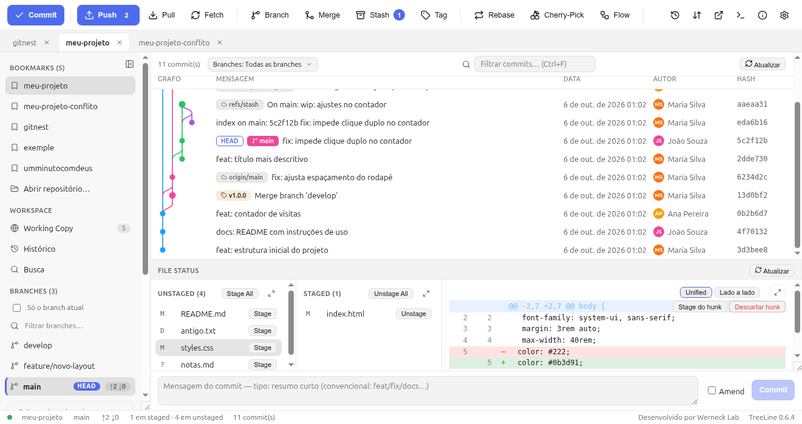
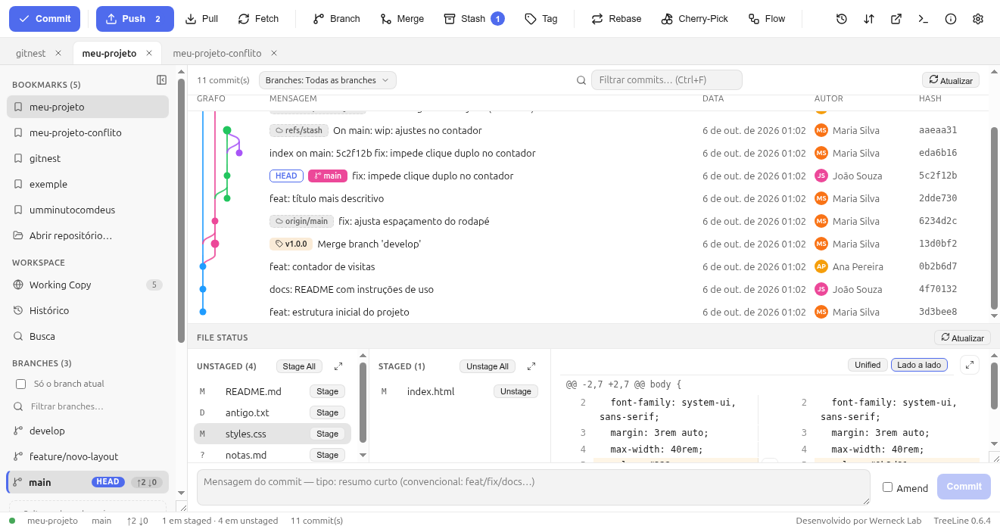
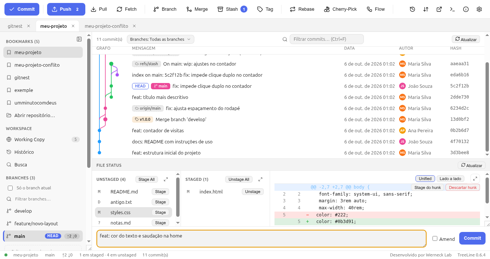

# 4. Stage e Commit — o fluxo do dia a dia

Este é o caminho que você repete 20 vezes por dia:

```
editar  →  olhar o diff  →  stage  →  escrever mensagem  →  commit
```

## 4.1 Veja o que mudou

Abra o projeto. O painel **File Status** (canto inferior direito) já mostra
o que está pendente, com o símbolo do Git ao lado de cada arquivo:

| Símbolo | Significado |
|---|---|
| `M` | modificado |
| `A` | adicionado (novo, mas já em stage) |
| `D` | deletado |
| `?` | novo, **nem** em stage (não rastreado) |

```
Unstaged (4)                          Staged (1)
  M  README.md                          M  index.html
  D  antigo.txt
  M  styles.css
  ?  notas.md
```

Clique num arquivo para ver o **diff** à direita: verde = linhas que entram,
vermelho = linhas que saem, azul = cabeçalho do hunk.



## 4.2 Dar stage (montar a foto)

Três formas, do mais grosseiro ao mais fino:

1. **Por arquivo** — passe o mouse sobre a linha e clique **Stage** (ou
   **Unstage** na coluna da direita para tirar de volta).
2. **Tudo de uma vez** — botão **Stage All** no topo da coluna Unstaged.
3. **Por trecho** — no diff, botão **Stage do hunk** manda só aquele bloco;
   clique nas linhas para selecionar um pedaço e usar o botão de stage do
   trecho.

Quer mandar metade de um arquivo para o commit e guardar a outra metade?
É exatamente isso que o stage por hunk/linha permite — e é o que separa um
commit limpo de um commit “lixeira”.

**Lado a lado** fica ainda mais claro:



- Botão **Unified** | **Lado a lado** no topo do diff.
- No modo lado a lado, a **seta →** de cada bloco manda o bloco inteiro para
  o stage (no painel Staged, a seta é inversa: devolve).
- O diff do lado Staged continua unificado (é só conferência).

> **Descartar** (clique direito no arquivo → Discard, ou botão do hunk) volta
> ao estado do último commit. Arquivo **rastreado** é restaurado; arquivo
> novo (`?`) vai para a lixeira do sistema — a confirmação sempre aparece.

## 4.3 Escrever a mensagem e commitar



1. Digite a mensagem no campo de baixo (o placeholder lembra: “Mensagem do
   commit”).
2. Clique em **Commit** ou aperte **`Ctrl+Enter`**.

O botão só ativa quando há **algo em stage** — se estiver cinza, o motivo
aparece no tooltip (“Nada em stage — dê stage primeiro”).

Checkbox **Amend**: usa o commit **anterior** como base e o substitui.
Sirva para completar um commit que você acabou de fazer (mensagem com erro,
arquivo esquecido) — **não** use num commit que já foi publicado com push,
senão vai precisar de force push.

## 4.4 Equivalente no terminal

```bash
git status                       # o que está em cada estado
git diff                         # unstaged (vs stage)
git diff --staged                # staged (vs último commit)
git add README.md styles.css     # stage por arquivo
git add -p                       # stage por hunk (o "Stage do hunk")
git add -A                       # tudo (Stage All)
git commit -m "feat: cor do texto na home"
git commit --amend               # amend
git restore README.md            # descartar mudanças (Discard)
git restore --staged README.md   # tirar do stage (Unstage)
```

## 4.5 Três erros clássicos (e como evitar)

1. **Commit gigante com 30 arquivos** — stage só o que pertence àquela
   ideia. O stage por arquivo existe para isso.
2. **Mensagem “correções”** — escreva *o quê* mudou e *por quê*; o diff já
   mostra o *como*.
3. **Commitar segredo** — senha/token em arquivo **nunca** entra no commit.
   Descarte o arquivo, troque a senha e, se o projeto for público, trate a
   credencial como vazada.

→ Continue em [5. Histórico e grafo](05-historico-e-grafo.md)
