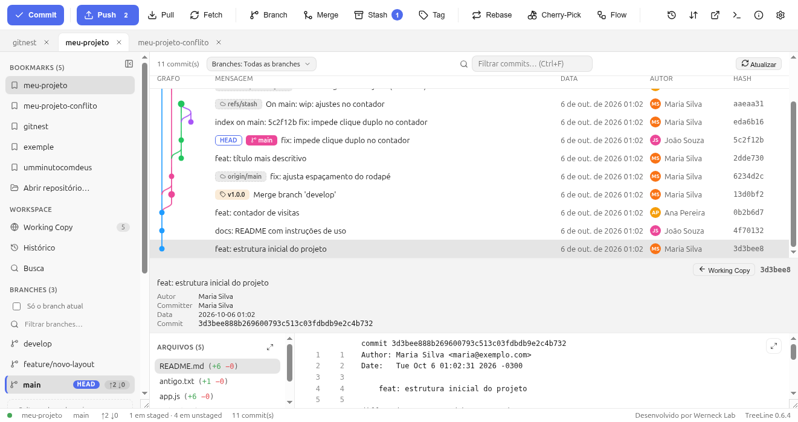
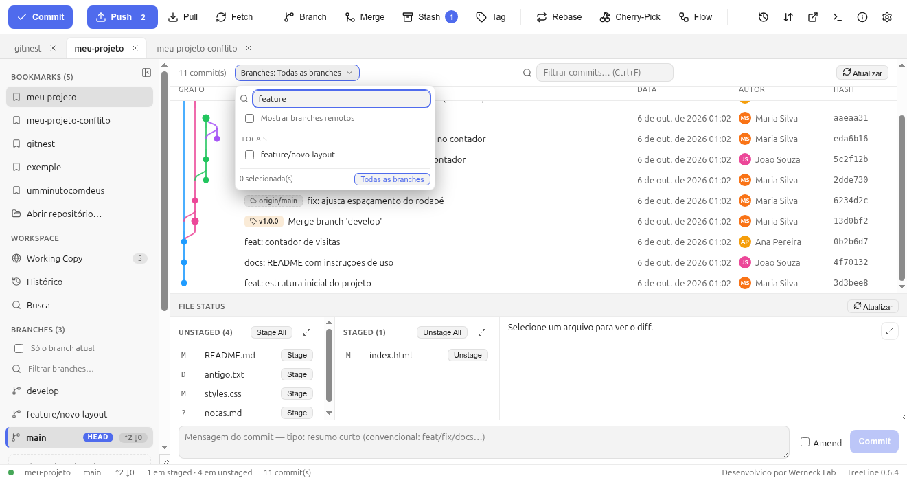

# 5. Histórico e grafo

O painel de histórico mostra **quem fez o quê, em que linha do tempo**.

## 5.1 Ler o grafo

- Cada **linha vertical colorida** é uma linha de desenvolvimento; os
  **pontos** são commits.
- Uma **curva** liga o ponto ao seu pai quando houve fork/merge — a curva
  aparece na cor do branch que “atravessa”.
- **Badges** à esquerda da mensagem dizem quem aponta para aquele commit:
  `HEAD -> main`, `develop`, `v1.0.0`, `origin/main`.
- **Colunas**: Grafo · Mensagem · Data (absoluta, ex.: `6 de out. de 2026
  00:45`) · Autor (com avatar de iniciais) · Hash (7 dígitos, clique copia).
- A primeira linha é sempre **Working Copy** — clique para voltar ao painel
  de arquivos.

## 5.2 Detalhe de um commit

Clique em qualquer linha:



Você vê:

- mensagem completa + badges das refs que apontam para ele;
- **Autor**, **Committer**, **Data**, **Commit** (hash completo) e **Pais**;
- **Arquivos (n)** com estatística `(+6 −0)`;
- o **diff** do arquivo clicado.

O botão **← Working Copy** (ou clicar de novo na linha) volta. Merge commits
podem não listar arquivos (o Git guarda o resultado como resolução do merge,
não como diff) — use o terminal (`git show -m <hash>`) se precisar.

Menu (clique direito no commit): copiar hash/mensagem/autor, **blame** e
histórico de um arquivo, criar branch/tag a partir dele, merge, rebase,
cherry-pick, revert, reset, comparar com outro commit, abrir PR.

## 5.3 Buscar commits

- `Ctrl+F` (ou a lupa na barra de filtros) filtra por texto na mensagem.
- O filtro **“Só o branch atual”** da sidebar restringe o grafo ao seu branch.

## 5.4 Combo de branches (ver só o que interessa)

O botão **Branches:** na barra de filtros escolhe **quais refs entram no
`git log`**:



- **Busca incremental** — digite “feature” e a lista encolhe na hora.
- **Checkbox “Mostrar branches remotos”** — traz `origin/...` para a lista
  (preferência guardada no app).
- **Grupos Locais / Remotos** e contador de **selecionada(s)**.
- Várias branches de uma vez → o grafo mostra a **união** das três.
- **“Todas as branches”** limpa a seleção (volta ao comportamento padrão,
  que é mostrar tudo).
- A seleção e o “só branch atual” da sidebar se **excluem mutuamente** — só
  um filtro ativo por vez, para você nunca achar que sumiram commits.

Por que importa: em projeto grande, “todas as branches” vira uma bagunça de
curvas. Filtrar por 2–3 branches deixa o grafo legível.

## 5.5 Comparar dois commits

Segure **`Ctrl`** e clique em dois commits → abre a comparação (arquivos e
diff entre eles). Útil para “o que mudou entre a ontem e hoje”.

## 5.6 Blame: quem escreveu esta linha?

Clique direito no arquivo (no File Status ou no detalhe) → **Blame**: abre o
arquivo com autor + commit de cada linha. **Histórico de arquivo** mostra
todos os commits que passaram por ele.

```bash
git log --oneline --graph --all    # o que o grafo desenha
git log -p -- arquivo.js           # histórico com diffs
git blame arquivo.js               # quem escreveu cada linha
git log main..feature/x            # commits que faltam na main
```

## 5.7 Desempenho

O histórico é **virtualizado**: mesmo com milhares de commits, só algumas
dezenas de linhas ficam no DOM — o scroll continua fluido (testado com
10.000 commits). Se o seu projeto for gigante, use o combo de branches ou a
busca antes de reclamar de “falta de commits”: o filtro é que está escondendo
os que não interessam.

→ Continue em [6. Branches, merge e rebase](06-branches-merge-rebase.md)
