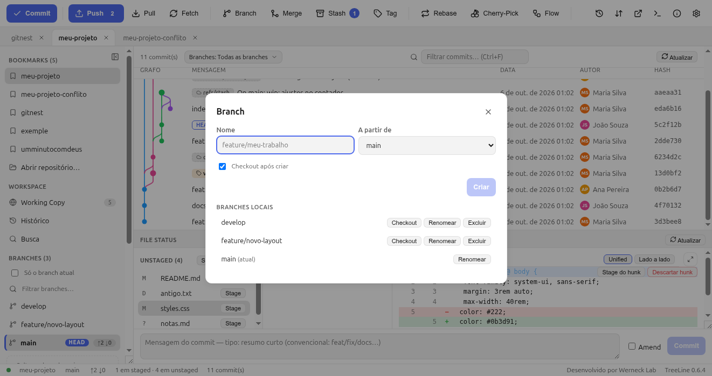
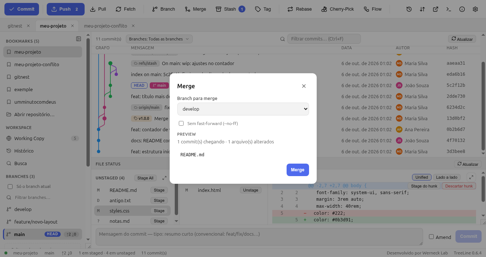

# 6. Branches, merge e rebase

Branch é a unidade de trabalho do Git: uma linha do tempo que você cria para
isolar uma feature, um hotfix ou um experimento.

## 6.1 Criar e trocar de branch



**Toolbar → Branch** abre o diálogo:

- **Nome** (ex.: `feature/login`) e **A partir de** (qual commit/branch é a
  base — padrão: o atual).
- Checkbox **Checkout após criar** — entra na branch na hora (quase sempre é
  isso que você quer).
- Abaixo, a lista das branches locais com a atual marcada como **atual** —
  clicar com botão direito dá **Renomear** e **Excluir** (excluir branch não
  mergiado exige confirmação; a opção **Force** avisa que commits podem “se
  perder” da branch — eles continuam no reflog).

**Pela sidebar:** duplo clique na branch = checkout. Com **working tree
suja**, o TreeLine oferece **“Stash + checkout”** — guarda suas mudanças,
troca de branch e você volta com `git stash pop` quando quiser.

**Pela paleta (`Ctrl+K`):** digite “branch” para criar/trocar sem tirar a
mão do teclado.

```bash
git switch -c feature/login        # cria e entra
git switch feature/login           # só entra
git branch -d feature/login        # apaga (seguro)
git branch -m novo-nome            # renomeia
```

## 6.2 Merge: juntar duas linhas



**Toolbar → Merge**:

- Escolha o branch a juntar e veja o **Preview**: quantos commits cheiam e
  quantos arquivos mudam **antes** de confirmar.
- Checkbox **Sem fast-forward (`--no-ff`)**: força a criação do commit de
  merge mesmo quando daria para apenas avançar o ponteiro. Fica mais claro
  no grafo (“aqui entrou a feature”).
- Se nascer conflito, o diálogo vira **Continue / Abort** (capítulo 9).

```bash
git merge feature/login             # fast-forward quando possível
git merge --no-ff feature/login     # sempre com commit de merge
git merge --abort                   # desiste e volta ao estado anterior
```

### Merge ou rebase?

| | Merge | Rebase |
|---|---|---|
| Histórico | Mostra a junção (curva no grafo) | Linear, “como se nunca tenha divergido” |
| Seguro para código já publicado? | Sim | **Não** — reescreve commits |
| Quando usar | Integração de feature, hotfix na main | Atualizar **a sua branch local** com a main |

Regra prática: **rebase no seu branch, merge na main**.

## 6.3 Rebase

**Toolbar → Rebase** → escolha o destino (normalmente `main`) → **Iniciar**.
Seus commits são reaplicados um a um sobre o destino.

- **Stash das alterações antes (`--autostash`)**: guarda alterações
  pendentes, faz o rebase e devolve — evita o erro de worktree suja.
- Em conflito, o rebase **pausa**: resolva, dê stage e clique **Continue**;
  ou **Abort** para voltar tudo como estava.
- **Rebase interativo**: abre o plano dos últimos commits para reordenar,
  editar, reescrever mensagem ou descartar (`squash`/`drop`). Um plano grande
  gera aviso antes de executar.

```bash
git rebase main
git rebase -i HEAD~3        # planejar os 3 últimos
git rebase --abort          # desiste
git rebase --continue       # continua depois do conflito resolvido
```

## 6.4 Cherry-Pick e Revert

- **Cherry-Pick**: copia um commit para o branch atual. Selecione o commit
  no grafo → toolbar **Cherry-Pick** (ou clique direito). Use quando o fix
  precisa existir em duas linhas e ainda não dá para mergear.
- **Revert**: cria um commit que **anula** o anterior. É a forma segura de
  desfazer algo que já foi para o remoto — nada é reescrito.

```bash
git cherry-pick abc1234
git revert abc1234
```

## 6.5 Reset (com cuidado)

Clique direito no commit → **Reset** escolhe o modo:

| Modo | Commits desfazem | Arquivos | Arquivo perdido? |
|---|---|---|---|
| **Soft** | sim | ficam **staged** | não |
| **Mixed** (padrão) | sim | ficam **unstaged** | não |
| **Hard** | sim | **voltam ao commit alvo** | sim, alterações não commitadas |

Antes do reset o TreeLine grava um **backup `git bundle`** em
`.git/treeline-backups/`, e a confirmação mostra exatamente o que será
perdido.

```bash
git reset --soft HEAD~1    # desfaz commit, mantém tudo no stage
git reset --hard HEAD~1    # desfaz commit E apaga mudanças (cuidado)
```

## 6.6 Tags

**Toolbar → Tag**: nome (ex.: `v1.0.0`), mensagem (preencher transforma em
*annotated*, com autor/data — recomendado para releases) e commit alvo
(padrão: HEAD). O menu inclui **push da tag**, **excluir** (com opção de
excluir também no remoto) e **checkout da tag** (fica *detached*, com aviso:
para commitar a partir da tag, crie um branch).

```bash
git tag -a v1.0.0 -m "release 1.0.0"
git push origin v1.0.0
```

## 6.7 Git-flow

**Toolbar → Git-flow** automatiza `feature/*`, `release/*` e `hotfix/*`
(start/finish com merge `--no-ff`). Se o `git-flow` não estiver instalado,
o diálogo oferece a **convenção manual** (mesmos nomes, comandos no lugar).

```bash
git flow feature start login
git flow feature finish login
```

→ Continue em [7. Stash](07-stash.md)
