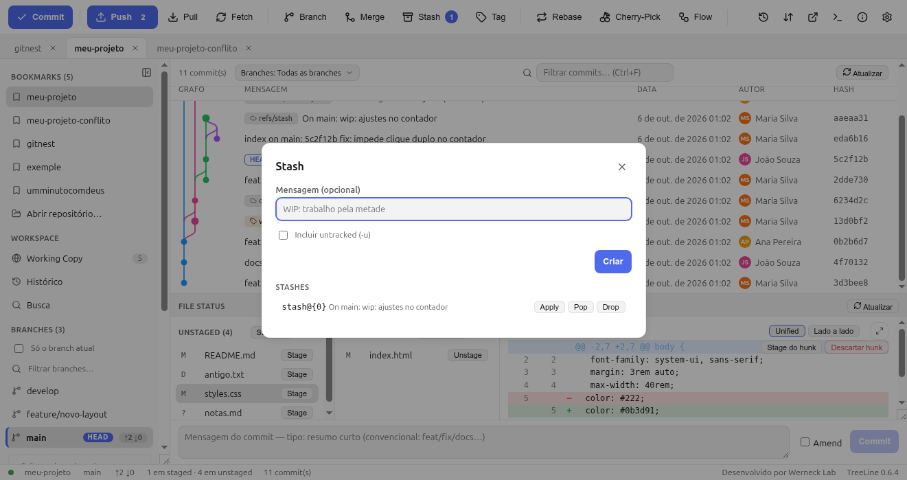

# 7. Stash — a gaveta temporária

Você está no meio de uma alteração e precisa trocar de branch (ou mostrar o
projeto limpo). **Não commit** aquilo pela metade, e **não perda** o
trabalho: use stash.

```
          stash push            stash pop
working tree ─────────►  gaveta  ─────────►  working tree (de volta)
  (limpa de novo)        (guardada)          (com as suas mudanças)
```

O stash são **commits de verdade**, guardados fora de qualquer branch — por
isso não “some” e pode ser recuperado pelo reflog (capítulo 10).

## 7.1 Guardar

**Toolbar → Stash**:



- **Mensagem (opcional)** — descreva o que está guardado; sem mensagem, o
  Git monta uma genérica (“WIP on main…”).
- **Incluir untracked (`-u`)** — leva também arquivos **novos** que ainda
  não estão no Git. Sem isso, seus arquivos novos ficam para trás e
  “aparecem de novo” depois do stash.
- A seção **Stashes** lista o que já está guardado (mais novo em cima).

Pela **sidebar → Stashes**: duplo clique aplica; clique direito dá
**Apply**, **Pop** e **Drop**.

```bash
git stash push -u -m "wip: painel pela metade"
git stash list
```

## 7.2 Recuperar

| Botão | Comando | Efeito |
|---|---|---|
| **Apply** | `git stash apply stash@{0}` | Devolve as mudanças e **mantém** o stash na gaveta |
| **Pop** | `git stash pop stash@{0}` | Devolve e **remove** o stash |
| **Drop** | `git stash drop stash@{0}` | Joga fora (com confirmação) |

**Pop** é o dia a dia; **Apply** quando você quer testar duas vezes ou
aplicar em outra branch.

Fluxo clássico:

```bash
git stash push -u -m "refatoração login"   # 1. guarda
git switch hotfix                          # 2. atende emergência
git switch feature/login                   # 3. volta
git stash pop                              # 4. retoma o trabalho
```

## 7.3 Stash com conflito

Se o arquivo mudou nos dois lados, o `pop`/`apply` pode parar com conflito.
O TreeLine detecta isso e mostra o aviso — o fluxo é:

1. Resolva os conflitos (o resolvedor 3 vias funciona aqui também, mas ele
   **não** tem “Continue” automático: conflito de stash não tem
   `git stash continue`).
2. Dê stage nos arquivos resolvidos.
3. **Concluir a resolução** — o stash continua na gaveta; commite o resultado
   e depois dê **Drop** do stash na mão.

```bash
git stash pop                      # deu conflito…
git status                         # vê os arquivos UU
# resolve no editor
git add arquivo.confuso
git stash drop                     # depois de commitar
```

## 7.4 Cuidados

- **Stash não é backup de longo prazo.** Ele fica fora de branch e é fácil
  de esquecer; coisas guardadas há meses viram “o que é isso mesmo?”.
- `stash drop` pede confirmação, mas depois de drop não há botão de voltar
  (salvo pelo reflog, no capítulo 10).
- Se você marcou **Incluir untracked** e o stash for descartado, os arquivos
  **novos vão junto** (eles só existiam dentro do stash).
- Antes de um `git clean` (apagar lixo) ou hard reset, dê uma olhada em
  `git stash list`.

→ Continue em [8. Remotos: push, pull e fetch](08-remotos.md)
