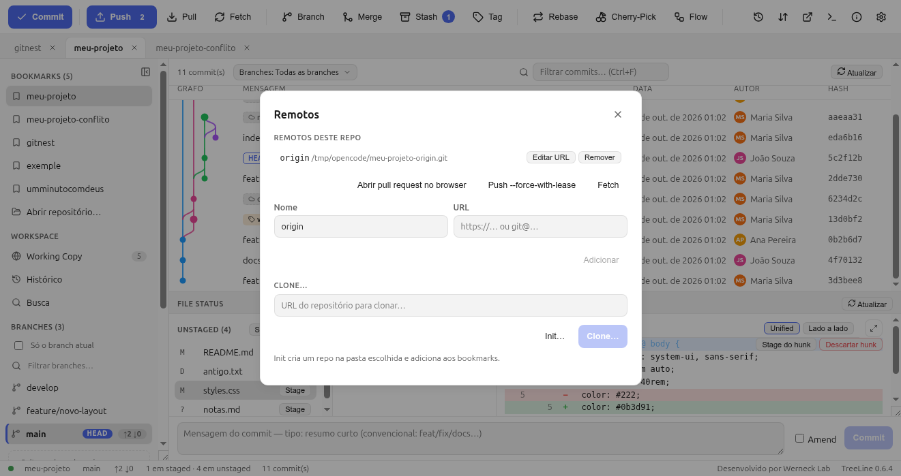

# 8. Remotos: push, pull e fetch

Até aqui tudo era local. O **remoto** é a cópia do projeto que o time vê —
normalmente um repositório no GitHub/GitLab.

## 8.1 O gerenciador de remotos

**Toolbar → Status de sync** (ícone de nuvem) abre o gerenciador:



- Lista os remotos e suas URLs (`https://…` ou `git@…`).
- **Editar URL** — mudou de SSH para HTTPS (ou trocou de conta)? É aqui.
- **Adicionar remoto** / **Remover** (com confirmação).
- **Clone…** traz um repositório existente para dentro do app;
  **Init…** cria um repositório novo numa pasta e já adiciona aos bookmarks.
- **Push --force-with-lease** e **Abrir pull request** ficam neste diálogo
  (também no menu do botão Push).

```bash
git remote add origin https://github.com/voce/projeto.git
git remote -v
git clone https://github.com/voce/projeto.git
```

## 8.2 Os três botões de sincronização

| Botão | Comando real | O que faz | Quando usar |
|---|---|---|---|
| **Fetch** | `git fetch --all --prune` | Baixa o estado dos remotos, **não mexe** nos seus arquivos | Quer ver o que mudou lá fora |
| **Pull** | `git pull --ff-only` | Fetch + **avança** o seu branch (sem criar merge escondido) | Antes de começar a trabalhar / ao voltar |
| **Push** | `git push` | Envia os seus commits | Terminou uma ideia |

Durante a operação aparece um **toast** com spinner e, no fim, o resumo
(`+2 −0` etc.). Erros vêm em linguagem humana: remote HTTPS sem credencial
orienta a usar `gh auth login` ou SSH; timeout sugere rede/VPN.

**Fetch automático**: Settings → **Sincronização** → *Fetch automático*,
com opção de rodar em segundo plano. Padrão: desligado.

## 8.3 Ahead / behind — quem está atrasado

A statusbar mostra `↑ 2 ↓ 0`:

- `↑ 2` (ahead) → você tem 2 commits **locais ainda não publicados** →
  **Push**. O botão Push fica destacado com a contagem.
- `↓ 1` (behind) → o remoto tem 1 commit que você ainda não baixou →
  **Pull** (ou clique na contagem, que dispara um fetch).

Na **sidebar**, cada branch mostra os próprios `↑↓` — dá para ver de longe
que `develop` está 3 commits atrás sem abrir nada.

O **upstream** (`main` ↔ `origin/main`) é o que permite `git push` sem
argumento. **Push** cria o rastro automaticamente na primeira vez.

## 8.4 Quando o push é rejeitado

Se o remoto avançou (colega empurrou antes), o push é rejeitado. Opções:

1. `git pull` (no TreeLine: **Pull**) e depois push — **sempre a primeira
   escolha**.
2. **Rebase** local e push de novo — histórico linear.
3. **Force with lease** (menu do botão Push) — **só** para commits seus que
   você sabe que precisa reescrever. O `--force-with-lease` recusa o force
   se alguém empurrou algo que você não viu — é a versão segura; o `git push
   --force` puro **não tem rede de segurança** e o TreeLine não o expõe.

## 8.5 Credenciais: sem senha dentro do app

O TreeLine **não** guarda senha nem token. Ele usa o que o sistema já tem:

- **HTTPS**: `credential.helper` do Git (no Ubuntu: `store` ou o keyring
  via `libsecret`). O `git credential` guarda o token e o app reaproveita.
- **SSH**: `ssh-agent` + chave em `~/.ssh/`. Se a chave tem passphrase, o
  sistema pergunta (ou o agent já está com ela).

Setup rápido de SSH:

```bash
ssh-keygen -t ed25519 -C "voce@exemplo.com"
cat ~/.ssh/id_ed25519.pub     # copia e cola em GitHub → Settings → SSH keys
ssh -T git@github.com         # testa (aparece "Hi voce!...")
```

> Se a sua credencial está em `~/.git-credentials` (helper `store`, texto
> plano), trate o arquivo como segredo: ele fica no seu `HOME`, nunca no
> repositório. O plano do TreeLine é migrar para o GNOME Keyring via
> `libsecret`.

## 8.6 Fluxo completo de um dia

```bash
git pull --ff-only           # 1. atualiza
# ...edita, stage, commit...
git push                     # 2. publica
```

No TreeLine: **Pull** (ou clicar nas setas da statusbar) → trabalhar →
**Commit** → **Push**. Pronto.

Para revisar o que vai subir antes: clique no commit no grafo (detalhe +
diff) ou `Ctrl+clique` em dois commits para comparar.

→ Continue em [9. Conflitos](09-conflitos.md)
