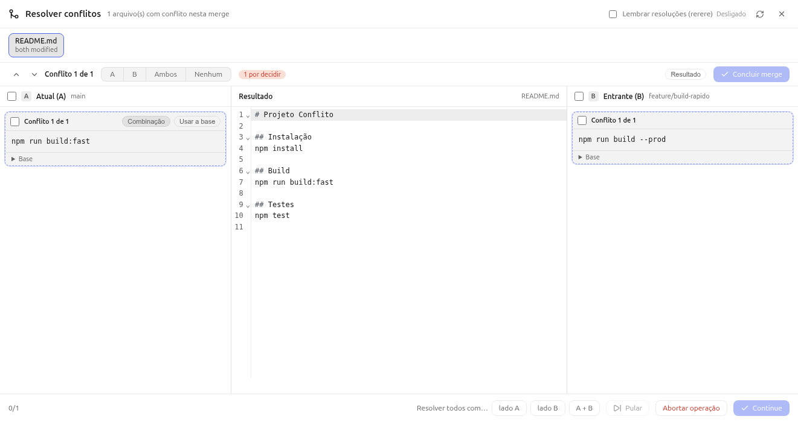

# 9. Conflitos — quando o Git pede sua opinião

Conflito **não é erro**: é o Git se recusando a escolher por você. Acontece
quando duas branches mudaram **as mesmas linhas** e ele não consegue adivinhar
a sua intenção.

```
        main:      "botão verde"     ──► "botão azul"
feature:           "botão verde"     ──► "botão redondo"
                              merge:  ???  (as duas mudanças nascem da mesma linha)
```

## 9.1 De onde vem

- Dois branches mudaram o mesmo trecho de um mesmo arquivo.
- Você deu **pull** com trabalho local na mesma área do que chegou.
- **Rebase** replays seus commits e o alvo mudou no meio.
- Cherry-pick de um commit que já foi alterado no destino.

O TreeLine marca tudo isso: coluna **Em conflito (n)** no File Status,
bolinha âmbar na toolbar e item clicável na statusbar.

## 9.2 Resolver no TreeLine (resolvedor 3 vias)

Clique no arquivo em conflito → no diff aparece a barra **“Em conflito —
escolha um lado por arquivo…”** → clique em **Editar resultado** (ou na
statusbar). O resolvedor abre em tela cheia:



Layout estilo WinMerge:

| Coluna | Conteúdo |
|---|---|
| **A** — *Atual (A)* | O lado **nosso** (`ours`), do branch em que você está |
| **Resultado** | O arquivo final — é **editável** (CodeMirror) |
| **B** — *Deles (B)* | O lado **deles** (`theirs`), que está chegando |

Como decidir, **por conflito** (o contador mostra “Conflito 1 de 1”):

- **Checkbox do bloco em A e/ou B** — marcado em A = fica só o nosso; em B =
  só o deles; **nos dois** = ficam as duas linhas (ambos); **nenhum** = fica
  a base (descarta os dois lados).
- **Seletor A | B | Ambos | Nenhum** na toolbar aplica ao conflito ativo.
- **Teclado**: `a` = lado A, `b` = lado B (alias `o`/`t`), `x` = ambos,
  `0` = nenhum, `n`/`p` = próximo/anterior conflito, `Esc` fecha,
  `Ctrl+Enter` conclui.

No topo: **“N por decidir”** (pill) enquanto ainda houver conflito sem
escolha. Botão **Resultado** alterna para ver só A|B (sem a coluna do meio).

No rodapé: **“0/1”** (resolvidos), **Abortar operação** e **Concluir
merge** — o botão certo muda conforme a operação (`Continue` em rebase,
cherry-pick e revert; stash fecha sem comando, porque stash não tem
`--continue`).

Cada lado pode ser decidido **inteiro** de uma vez (checkbox no cabeçalho do
painel) ou conflito por conflito.

## 9.3 Depois de resolver

1. Todos os arquivos ficam no **index** (stage) com o resultado.
2. Clique em **Concluir merge** (ou Continue).
3. O TreeLine confere se não sobrou arquivo `unmerged` e finaliza a
   operação; aparece o commit de merge no histórico.

Se preferir desistir: **Abortar operação** — o Git volta exatamente ao
estado anterior (`git merge --abort`, `git rebase --abort`…). Antes de
escrita destrutiva, ele grava um **backup `git bundle`**.

## 9.4 O mesmo fluxo no terminal

```bash
git merge feature/x
git status                        # vê os "both modified: arquivo"
# ...edita o arquivo, tira os marcadores <<<<<<< ======= >>>>>>> ...
git add arquivo                   # marca como resolvido
git commit                        # finaliza o merge
# ou
git merge --abort                 # desiste
```

Marcadores no arquivo:

```
<<<<<<< HEAD
nosso texto
=======
texto deles
>>>>>>> feature/x
```

> O TreeLine faz isso visualmente: ele lê os **stages 1/2/3** do Git (base,
> nosso, deles) e monta as colunas — inclusive para *delete/modify*, em que
> o Git nem deixa marcador no arquivo.

## 9.5 Rerere: lembrar a resolução

Settings → **Conflitos → Lembrar resoluções (rerere)** (opt-in por
repositório). Com ligado, se o **mesmo** conflito aparecer de novo (ex.: um
rebase cancelado e refeito), o Git reaplica sozinho a resolução que você já
deu.

```bash
git config rerere.enabled true
```

## 9.6 Dicas para conflito raro

- Faça **pull com frequência** — conflitos pequenos são triviais; deixar o
  branch divergir por dias vira um nó.
- **Rebase na sua branch** (atualiza você sem mexer na main) em vez de
  mergear a main o tempo todo.
- Separe arquivos por responsabilidade: times que mexem nos mesmos 3 arquivos
  sempre vão se trombar.
- Antes de operações grandes: `git stash` ou um commit limpo. Sujeira
  pendente multiplica os pontos de conflito.

→ Continue em [10. Recuperação e reflog](10-recuperacao-e-reflog.md)
