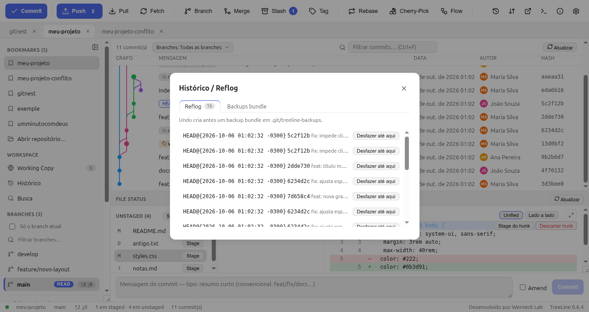

# 10. Recuperação e reflog — como desfazer quase tudo

Quase todo “perdi meu trabalho” no Git tem saída. Este capítulo é o
**bombeiro**: o que apertar quando algo deu errado.

## 10.1 Reflog: o GPS do Git

O **reflog** é o registro de para onde o `HEAD` foi nos últimos meses:
checkouts, commits, resets, rebases, merges. Se você está perdido, é o
primeiro lugar a olhar.

**Toolbar → Histórico / Reflog**:



O diálogo tem duas abas:

- **Reflog** — cada entrada: o que aconteceu (`commit`, `checkout: moving
  from…`, `reset`…), o hash resultante e quando. Clique numa entrada →
  **Desfazer até aqui**.
- **Backups bundle** — os `git bundle` gerados automaticamente **antes** de
  operações destrutivas (reset, rebase, op destrutiva), salvos em
  `.git/treeline-backups/`. Dá para restaurar de um deles.

```bash
git reflog                      # o que aconteceu com o HEAD
git reflog show main            # de um branch específico
```

## 10.2 Receitas de emergência

| Situação | Solução |
|---|---|
| Commit feito com mensagem errada, **ainda sem push** | Clique direito → **Commit** com *Amend*, ou `git commit --amend -m "nova"` |
| Commit feito na **branch errada** | Clique direito → criar branch a partir dele / `git branch boa-branch && git reset --hard HEAD~1` na errada |
| Commit que **não devia existir**, ainda sem push | Clique direito → **Reset** (mixed mantém arquivos, soft mantém até staged) |
| Commit **já publicado** que precisa sumir | Clique direito → **Revert** (cria commit que anula; não reescreve histórico) |
| Apaguei arquivo por engano | `git restore arquivo` (ou clique direito do arquivo no tree… use o terminal: `git checkout -- arquivo`) |
| Trabalho perdido no meio de um merge | **Abortar operação** (nada foi commitado) |
| Sumiu do stash | `git stash list` → `git stash apply stash@{0}`; sem sorte: `git fsck --unreachable` + `git show <hash>` |
| Troquei de branch com trabalho não commitado | `git stash list` → o TreeLine ofereceu “Stash + checkout”; devolva com pop |
| HEAD *detached* (commit solto, sem branch) | `git switch -c resgate` para criar um branch no lugar — commits “órfãos” se perdem se você só sair |

## 10.3 Reset × Revert × Discard

| | O que faz | Reescreve histórico? | Seguro com push? |
|---|---|---|---|
| **Discard** (arquivo) | Volta o arquivo ao último commit | não toca em commit | sim |
| **Reset --soft** | Desfaz commit, mantém tudo staged | sim (local) | só se não publicou |
| **Reset --mixed** | Desfaz commit, mantém arquivos | sim (local) | só se não publicou |
| **Reset --hard** | Desfaz commit **e** apaga mudanças | sim | **não** |
| **Revert** | Cria commit que anula outro | não | **sim** |

O TreeLine: clique direito no commit → **Reset** (modo escolhido, com
confirmação + backup) ou **Revert**. Descartar arquivo: clique direito no
arquivo → **Discard** (confirmação; novo não rastreado vai para a lixeira).

```bash
git reset --mixed HEAD~1      # desfaz commit, mantém arquivos
git revert abc1234            # anula publicado
git restore arquivo           # volta 1 arquivo
```

## 10.4 Backups automáticos

Antes de escrita destrutiva (reset, rebase, drop de operação), o TreeLine
grava:

```
.git/treeline-backups/<data>.bundle
```

Um `git bundle` é um arquivo com o histórico — restore:

```bash
git bundle verify .git/treeline-backups/2026-10-06.bundle
git pull .git/treeline-backups/2026-10-06.bundle main
```

## 10.5 Erros “assustadores” que são normais

| Mensagem | O que é | O que fazer |
|---|---|---|
| `index.lock` / “another git process” | Outro Git (ou o app) está com o repositório travado | Feche a outra operação; se sobrou lock antigo, `rm .git/index.lock` (só quando tiver certeza que nada roda) |
| `Please tell me who you are` | Sem identidade de autor | Settings → **Identidade do autor** (nome + email) |
| `non-fast-forward` / `fetch first` | O remoto adiantou | **Pull** e push de novo |
| `failed to push some refs` | Idem, ou branch sem upstream | Pull; ou clique no push de novo (ele cria o rastro) |
| `detached HEAD` | HEAD num commit solto | `git switch -c novo-branch` |
| `Merge conflict` | Capítulo 9 | Resolva e Continue |
| `nothing to commit, working tree clean` | Não há nada staged | Normal — trabalhe ou dê stage |

→ Continue em [11. Atalhos e ferramentas](11-atalhos-e-ferramentas.md)
