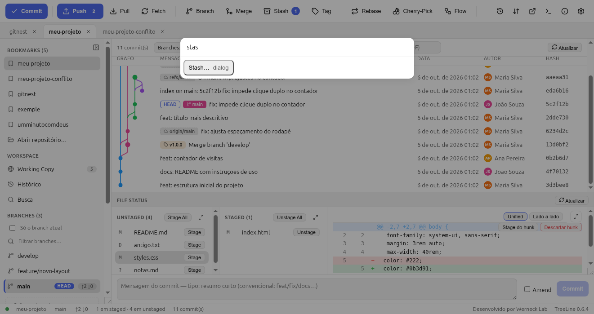
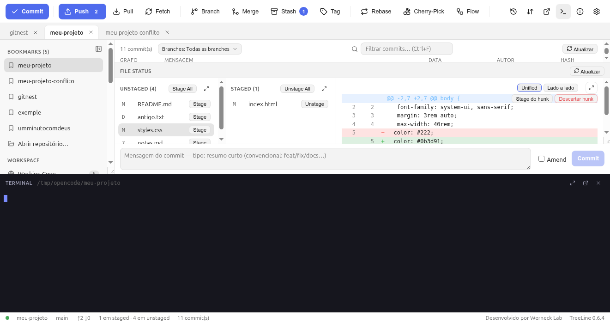
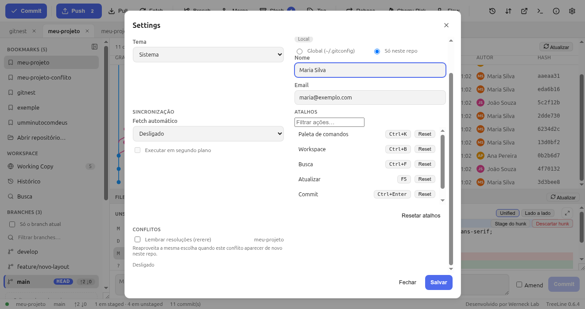
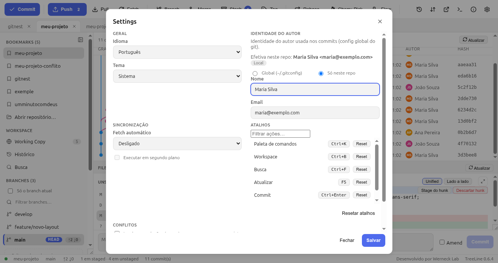

# 11. Atalhos e ferramentas

## 11.1 Paleta de comandos (`Ctrl+K`)

Se você não lembra onde algo fica, aperte `Ctrl+K` e digite:

A paleta lista: operações (branch, merge, stash, rebase, reset…), telas
(Settings, Terminal, Reflog, Remotos), ações de arquivo, **Custom Actions**
que você criar e comandos de tema/idioma. Setas navegam, `Enter` executa,
`Esc` fecha.

## 11.2 Terminal integrado (`Ctrl+\``)

Um shell **real** na pasta do repositório, no rodapé do app:

- Sessão por repositório (troca de aba não perde o histórico).
- Botões: **reiniciar shell** e **pop-out** (abre no Ptyxis/GNOME Terminal
  externo, com a pasta certa).
- Arraste a borda para aumentar; os painéis de diff também têm expandir.

Use quando o Git visual não cobrir algo (scripts, `npm`, `ssh`). O TreeLine
não tenta substituir o terminal — ele só evita que você saia da janela.

## 11.3 Abas de repositório

Vários projetos abertos ao mesmo tempo, em abas no topo:

- **Arraste** para reordenar; fechar a aba não fecha o repositório dos
  bookmarks.
- Cada aba guarda a seleção do grafo e os painéis.

## 11.4 Atalhos de teclado

| Atalho | Ação |
|---|---|
| `Ctrl+K` | Paleta de comandos |
| `Ctrl+B` | Recolher/expandir sidebar |
| `Ctrl+F` | Busca no histórico |
| `Ctrl+Enter` | Commitar |
| `` Ctrl+` `` | Terminal |
| `F5` | Atualizar (status, log, diff) |
| `Esc` | Fechar modal / recolher painel expandido |

**São remapeáveis**: Settings → **Atalhos** — clique no atalho, aperte as
teclas novas; o app **detecta conflitos** (“as duas ações disparam”) e tem
reset por linha.

## 11.5 Settings

Modal em duas colunas:

| Seção | O que tem |
|---|---|
| **Geral** | Idioma (English/Português/Español) e **Tema** (System + 5 claros + 5 escuros: TreeLine Light, Paper, Sandstone, Mint, Sky / TreeLine Dark, Midnight, Forest, Graphite, Plum) |
| **Identidade do autor** | Nome e e-mail usados nos commits (é o `git config` — salva Global `~/.gitconfig` ou só neste repositório), com a identidade **efetiva** mostrada |
| **Sincronização** | **Fetch automático**, com opção de rodar em segundo plano |
| **Conflitos** | **Rerere** (lembrar resoluções), opt-in por repositório |
| **Atalhos** | Remapeamento com filtro, conflitos e reset |

## 11.6 Outras ferramentas

- **Custom Actions** (`Ctrl+K` → “Custom Actions”): comandos seus rodando no
  shell do repositório, com tokens `{{repo}}`, `{{branch}}`, `{{file}}`,
  `{{commit}}` e saída colorida (ANSI) no app.
- **Git LFS**: diálogo próprio (padrões do `.gitattributes`, track/untrack,
  pull/push) — requer `git-lfs` instalado.
- **Submódulos**: na sidebar, com `update --init --recursive`.
- **Blame** e **histórico de arquivo**: clique direito no arquivo.
- **Comparar commits**: `Ctrl+clique` em duas linhas.
- **Sobre** (ícone ⓘ): versão, licença MIT e **Verificar atualizações**
  (chega no GitHub Releases).
- **Botão direito em tudo**: commits, arquivos, branches, tags, stashes,
  bookmarks — o menu sempre tem copiar/revelar/blame/discard.

## 11.7 Privacidade e segurança

- Sem telemetria; nada sai da máquina sem você pedir (push/pull/PR).
- Credenciais no `credential.helper` / `ssh-agent` do sistema — nunca em
  `config.json`, log ou linha de comando.
- Logs (para diagnosticar) em `~/.config/TreeLine/logs`.
- Force push só via **`--force-with-lease`**, com confirmação.
- Reset hard/rebase: confirmação + backup `git bundle`.

→ Continue em [12. Glossário e erros comuns](12-glossario-e-erros.md)
